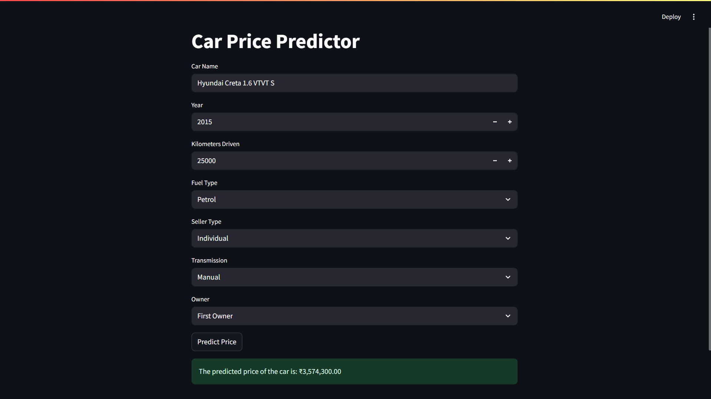
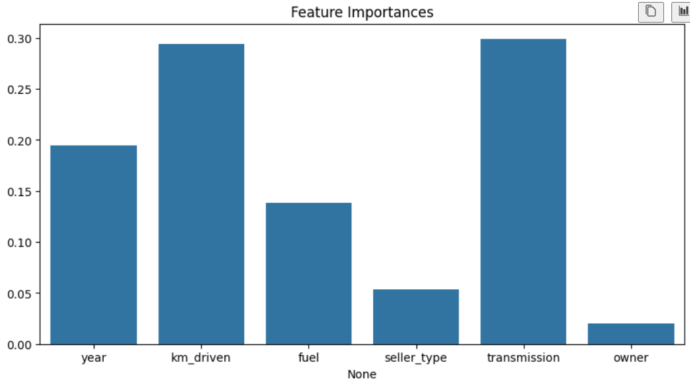

# 🚗 Used Car Price Predictor - Machine Learning Project

<p align="center">
  
</p>

## 📌 Overview

This project predicts the **resale price of used cars** using machine learning models trained on a dataset from CarDekho (Kaggle). It can help car sellers or buyers estimate a fair selling price based on features like mileage, fuel type, transmission, and more.

## ✅ Tech Stack

- Python
- Pandas, NumPy, Matplotlib, Seaborn
- Scikit-Learn (Random Forest Regressor)
- Streamlit (for web app deployment)
- Joblib (model saving)
- Jupyter Notebook / Cursor IDE

---

## 📁 Dataset

- **Source:** [CarDekho Kaggle Dataset](https://www.kaggle.com/datasets/nehalbirla/vehicle-dataset-from-cardekho)
- 8 Features and 1 Target (`Selling_Price`)
- Categorical and numerical data

---

## 🔍 Features Used for Prediction

- Year
- Present Price
- Kms Driven
- Fuel Type
- Seller Type
- Transmission
- Owner

---

## 📈 Model Performance

- **Model:** Random Forest Regressor
- **R² Score:** `0.92`
- **RMSE:** `0.57`
- **MAE:** `0.35`

<p align="center">
  
</p>

---

## 🧠 Machine Learning Pipeline

1. Data Preprocessing & Label Encoding
2. Exploratory Data Analysis (EDA)
3. Feature Engineering
4. Model Training & Evaluation
5. Model Saving using `joblib`
6. Streamlit app for user interaction

---

## 🌐 Streamlit App Demo

<p align="center">
  
</p>

### 🖱️ Try it locally

```bash
streamlit run app.py
